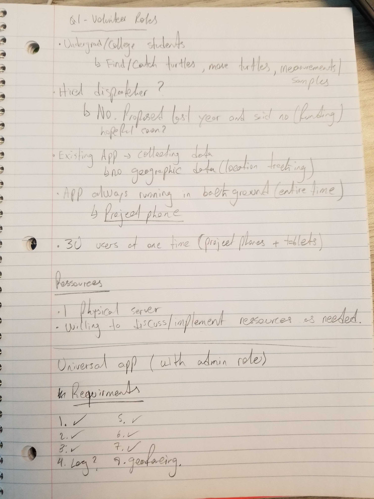

# Turtle Gang

## Product Details
 
#### Q1: What are you planning to build?

A mobile Android app that tracks the locations of field volunteers. During an emergency, access to real-time data can save precious time for rescue teams to locate a volunteer. Another issue faced by conservationists is the ability to coordinate their volunteer resources. For instance, when an injured turtle is reported, staff would like to be able to view the teams nearest to the site for the quickest possible response time. Our mobile app will aid in facilitating information and communication among staff and volunteers so that more turtles can be saved. We will also be building a simple web app that allows the user to export location data to a file.

#### Q2: Who are your target users?

Our target users are both paid summer staff and seasonal volunteers working for the Georgian Bay Turtle Hospital. There are also senior staff who oversee the volunteers and day-to-day operations, as well as dispatchers who answer turtle hotline calls from the local community. Volunteers are mostly university undergraduates and recent grads. Their goals are to find and rescue as many turtles as they can without putting their own safety at risk. They also want to focus on saving turtles without having to constantly stop and note their location. Frequently, volunteers forget to record the locations they visited which also causes problems for the senior staff at the hospital who are trying to chart their volunteers' movements. Moreover, manually recording location is imprecise, especially in remote areas. For the senior staff, their volunteers' safety is a priority. Without knowing the precise location of a volunteer, rescue teams will have much greater difficulty locating a volunteer in trouble. For hotline dispatchers, knowing where the volunteer teams are located helps them decide who to assign to a turtle call. Sometimes, they assign a team to go find an injured turtle without knowing there is a closer team. As a result, the assigned team arrives too late to save the turtle. Volunteers, senior staff, and dispatchers will use this app everyday during the turtle season (summer).

#### Q3: Why would your users choose your product? What are they using today to solve their problem/need?

We are building our product with the exact specifications required by our partner. Our app will automatically track user location, provide users with more accurate location data, and update data frequently. This solves the problem of relying on volunteers to manually recording their movements, which they may forget to do. More accurate location data lets senior staff at the Georgian Bay Turtle Hospital to be more confident in knowing where there volunteers are at any given moment. The improved accuracy will also help to identify which areas have and haven't been covered. Moreover, live updates allow overseers to alert teams of nearby turtle sightings for faster response times, which in turn will save more turtle lives. Most importantly, location tracking, as well as an emergency alert button, increases volunteer safety.

#### Q4: How will you build it?

We will use the Android SDK with Java to build the mobile application. We will use the google maps API to determine the location of the user of the phone and the SmsManager API to help with the sending of text messages. Since the application will involve both communication with SMS and internet communication, we will need to have a "twinned" client-server communication architecture. Some communication should be done over SMS, while other communcation is done over an internet network. The former for short messages like requesting help in an emergency, whereas uploading data may be done over the network. 

The mobile client should periodically submit POST requests to the server to update its location (along with a timestamp) to update its location so long as it has access to mobile data. When the mobile client goes offline (for example, because it has lost connection or because it has exceeded its maximum battery life), it whould continue to store its location at the same interval. When it regains connection it should attempt to POST its previously un-reported location data before reverting to its previous behavior when online.

Every instance of the mobile app should be able to communicate with a central server is controlled by the main office. The current solution uses a manually-updated google spreadsheet. If budget is a concern we *can* use the Google Sheets API to continue to do this, albeit without the manual updates however this will not allow for a large volume of requests at all and privacy may be a concern. If some resources may be dedicated to server hosting then this should not be an issue. 

There should be a web application that allows for viewing of the data retrived on the central server. The web application does not need to concern itself with online/offline behaviour; it would be assumed that it is being used with a reliable internet connection. We will use JHipster to generate a template of backend and web-app.

Our testing strategy should involve a mixture of unit testing for individual functions, especially for the critical ones that get used in many places in the codebase. Interaction between different sections, specifically between the mobile applications (apps) and the central server should be verified by integration testing. 

We will deploy our backend server to Compute Canada, once our partner get approval. Until GBTH provides web hosting service, we will use a free web hosting site such as Heroku for testing purposes. For our final version, administrators can access and manage recourses via a web app, and field staffs/volunteers can download our Android app from Google Play store. The mobile app is not for public use, so mobile users need to get approval from administrators. 

#### Q5: What are the user stories that make up the MVP?
TRELLO LINK: https://trello.com/invite/turtlegang1/c057ba3545931afd41ee29ca85acb40d

As a senior staff member, I want to collect staff/volunteer location data in order to track their movements in the field. 

As a dispatcher, I want to see the location and status of all my teams on map in order to assign nearby teams to turtle hotline calls.

As a field technician, I want to see all the locations of turtle hotline calls on map, entered by dispatchers, in order to respond to the hotline calls quickly.

As a senior staff member, I want to see the location of my teams in order to increase safety and facilitate rescue teams in case of emergencies.

As a senior staff member, I want to be able to export a .csv file of staff/volunteer location data in order to plot this data on ArcGIS, a geographic information system mapping software.

As a senior staff member, I want to be able to only export the data points in a given time interval and for a certain device, in order to better analyze plotted data.

As a supervisor, I want to be able to plot virtual boundaries (geofences) so my reportees do not cross out of the designated priority areas.

As a supervisor, I want to be notified when my reportees cross in and out of designated priority areas, so that I can be aware of when they left and arrived from their duties.

As a supervisor, I want to be able to upload a KML file generated by Google Maps to plot my geofences so that they can be easily changed in the future.

As a field technician, I want to upload data automatically whenever wifi is connected in addition to storing it on the device's SD card in order to avoid large amounts of data loss if the device is damaged.

As a field technician, I want the app to collect location data automatically in order to avoid lost data because I forgot to manually turn on location tracking.

As a field technician, I want to be able to broadcast an alert message to the whole team with my location via SMS so that help can be sent as soon as possible.

As a field technician, I want 2-step confirmation before broadcasting an alert message in order to avoid false alerts.

As a field technician, I want to be alerted when I cross into/out of designated priority areas so I can turn around.

As a field technician, I want the app to record the device, time, date and location when I cross into core sites that I survey regularly, so that I can know the start and stop time of a particular survey.

As a field technician, I want the app to notify me if I cross into a designated geofence area, in order to know if I have reached my designated site.

As a field technician, I want the app to notify me if I cross out of a designated geofence area, in order to know if I have left a designated site or accidentally left the area covered by our permit.

As a field technician, I want the app to notify me to double check that I have recorded external data such as vehicle odometer at designated zone, in order to prevent data loss.

----

## Process Details

#### Q6: What are the roles & responsibilities on the team?
Roles and Responsibilities

Lead frontend developer: 
* Keeps Trello up to date with task progress
* Adds and assigns tasks to Trello
* Contributes to programming the frontend
* Consults with Lead backend developer to ensure front and backends will work together
* Responsible for ensuring deadlines for frontend tasks are met

Frontend developer:
* Contributes to programming the frontend
* Should defer to Lead frontend developer on questions about frontend implementation

Lead backend developer: 
* Keeps Trello up to date with task progress
* Adds and assigns tasks on Trello
* Contributes to programming the backend
* Consults with Lead frontend developer to ensure front and backends will work together
* Responsible for ensuring deadlines for backend tasks are met

Backend developer:
* Contributes to programming the backend
* Should defer to Lead backend developer on questions about backend implementation

Liason:
* Facilitates communications between the team and Partner and/or TA
* Keeps TA and Partner up-to-date with team's progress
* Sets up meetings with Partner and/or TA

Meetings Coordinator:
* Arranges time and place of meetings for the team.
* Creates the agendas for meetings
* Emcees the meetings to ensure they stay on topic and don't lull

##### Team Members
Keena (Frontend Lead)
* Strengths: Google Maps API, HTML & CSS, UI
* Weaknesses: code optimization, writing unit tests, writing servers

Neumann (Backend Lead)
* Strengths: Java, Backend Development, Node.JS, SQL
* Weaknesses: UI/UX, Frontend Development, iOS Development

Taewoo (Liason, Backend)
* Strengths: Java, Android Studio, PostgreSQL
* Weakness: UI design, documentation, product management

Yichen (Backend, Meetings Coordinator)
* Strengths: Python, Java, SQL 
* Weaknesses: web design, android app design, front-end(but willing to try and learn for the team)

Haocong (Frontend)
* Strengths: C#, CSS, Javascript
* Weaknesses: Directionally challenged, UI, Mobile development

Layana (Frontend)
* Strengths: C, Python, Java
* Weaknesses: Web development, Mobile development

Arshia (Backend)
* Strengths: R, Python, SQL
* Weaknesses: Web development, Frontend, UI Design


#### Q7: What operational events will you have as a team?
 We will have in-person meetings every other week and on the weeks when deliverable is due. We will meet on campus. Once a week, we will check-in with each other using Slack or video call. The purpose of these meetings are to report what we have done and what is left to do, assigning tasks, and discussing implementation details or difficulties encountered. 

 During our first team meeting we went through this planning.md file, brainstormed answers, and came up with questions for our partner. During our second meeting (after meeting with our partner), we continued working on this document and formalizing our ideas. Our combined meeting minutes can be found here https://docs.google.com/document/d/19iLVuml8uQ2Vlt5zQhawN_3j5OjS0iVcaWYdcA3FR-8/edit?usp=sharing.

In addition to this, we will provide biweekly status updates to our partner. These updates may take the form of video calls (eg: Google Hangouts) or through emails.

 During our first partner meeting, we asked what their current solution is and its problems, the role of each type of person in their organization, how many staff members/volunteers they have, and what technologies they have available for us to use. Then we walked through their proposal document so they could explain each requirement in detail. Meeting minutes below
 


 Everyone should respond to ```@channel``` Slack messages within 48 hours to indicate they have read it.

Describe meetings (and other events) you are planning to have. 
 * When and where? Recurring or ad hoc? In-person or online?
 * What's the purpose of each meeting?
 * Other events could be coding sessions, code reviews, quick weekly sync meeting online, etc.
 * You must have at least 2 meetings with your project partner (if you have one). Describe them here:
   * What did you discuss during the meetings?
   * What were the outcomes of each meeting?
   * You must provide meeting minutes.
   * You must have a regular meeting schedule established by the second meeting.  
  
#### Q8: What artifacts will you use to self-organize?

We will be using Slack to communicate with each other, Trello for task assignments and tracking, Google Drive to share collaborative documents such as meeting minutes, and When2Meet to coordinate meeting times.

Tasks will be assigned by capability. For instance, those familiar with creating mockups will be assigned this task. Tasks will also be distributed to maintain an even work load for all members. During in-person meetings, we will come up with a list of tasks that need to be accomplished on Trello. Features that must be implemented before other tasks can be started/completed will be given priority. Tasks will be given a time period in which they should be completed. A task will be considered completed once it has been tested (if applicable), 2 other team members have reviewed it, and the code has been merged to master (if applicable). Assignments will be determined by the group during meetings. Teammates can volunteer for tasks. Frontend and Backend lead developers may also assign tasks as they see fit. If more than one teammates want to do the same task, we encouarge members who have wider range of capabilities give up the task and get other tasks that they are capable of. Otherwise, we will use drawing lots among voluteers to assign conflicting tasks.

#### Q9: What are the rules regarding how your team works?

**Communications:**

We will be using Slack as our main method of communication amongst team members. Everyone should respond to ```@channel``` Slack messages within 48 hours to indicate they have read it. We expect to hear from each team member at least once a week to report their progress.

If we have questions for our project partner, we will compile them into a Google Document or Slack channel. Then one person will send an email to the partner with the questions. They will CC the other team members and our TA. If we want to have a discussion with our partner, we will create an agenda first, and then video call them. We have also provided our partner one of our cell phone numbers and have gotten his in return.
 
**Meetings:**
We plan have at least one meeting per week either in person or over video call. We use When2Meet to decide when is the most suitable time for the group meetings. We will usually have a meeting on a weekday, and another meeting during the weekend, if necessary. The specific meeting time is flexible since everyone has different schedules. Meetings can either be in person or online. For anyone who cannot attend the meeting, they should provide a reason why they could not attend and catch up on what is going on in the meeting. If they cannot meet in person, they should use google hangouts to join the meeting. During meetings, everyone should tell their progress of their current tasks. They should also seek help if they encounter any issues in their work. We will use Trello for assigning tasks and checking the progress of tasks.  
 
**Conflict Resolution:**
 If a teammate is unresponsive, we will direct message on Slack or through email. If they do not reply, we will speak to them during class or tutorial. If they do not attend class, tutorials, or team meetings, we will ask our TA to contact them on our behalf. If a teammate is unable to complete a task because it was more difficult than we originally thought, we will assign another person to work on the task at the same time. We will schedule extra time to account for this possibility. But if the teammate is blowing off the project, we will directly speak with them about the problem (with TA mediating if necessary). If their behaviour does not change, we will be forced to shift the workload to the other members and rely on the course's auto 0 policy. If two teammates have a disagreement about how to proceed with development, they will each be allowed to present their side and the team will discuss a compromise.

----
### Highlights

 * 1. For the team communication tool, there are two options, Messenger and Slack. Messenger is a communication tool that everyone is using now, and it provides read receipts for us to see whether everyone sees messages or not. For Slack, it is a well-known team communication tool that is specifically designed for teamwork. Eventually, we choose Slack, because we can create multiple channels to keep track of multiple parts of projects. Furthermore, we can easily go back and check past messages in case if we forget what we say and do not record it.
 * 2. When we are deciding which partners we want to pick for the team project, everyone read descriptions for 8 partners and summarize what they want. Then based on the summaries, everyone picks three partners that are interesting to them. Then we have seven of them on the list. We discuss the pros and cons, and in the end, we vote to choose the best three for the partner application. Eventually, we choose Georgian Bay Turtle Hospital, Be One to Give and StopGap Foundation. These are been chosen because they all sound interesting and achievable for us. One of the main reasons we choose them over others is because others may require IOS apps, which is better to be implemented in the Mac OS system. However, the majority of us use windows.
 * 3. For the programming languages to use, we have few alternatives, Java, React and Kotlin. They all support for android app development. React is relatively easier for app development for both IOS and Andriod, however, it can be cumbersome to use native APIs. Whereas Java does support all native APIs. Kotlin has similar code as Java, but we can write much less code in Kotlin than write in Java to achieve the same results. Eventually, we decided to use Java, because we only need to implement this program on Android system (partner says no need to make one for IOS), and we think Kotlin is not mature enough. In addition, everyone in the team knows Java better than the other two programming languages.
